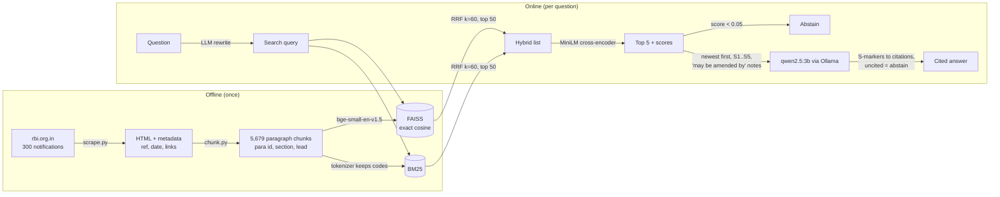

# CircularIQ

Cited question answering over Reserve Bank of India circulars, for the people who read them for a living: compliance teams at banks and NBFCs.

Ask *"How long does a commercial bank have to decide whether a red-flagged account is a fraud?"* and CircularIQ finds the paragraph, answers in plain language, and cites it:

> The process should ordinarily be completed within 180 days from the date the account was first reported as red-flagged on CRILC **[RBI/DoS/2026-27/412, Para 31]**.

When the circulars don't contain the answer, it says **"Not found in the provided circulars."** instead of guessing.

Runs fully offline on a laptop: local embeddings, a local cross-encoder, and a local 3B LLM through Ollama.

## Architecture



| Stage | Choice | Why (details in [decisions.md](decisions.md)) |
|---|---|---|
| Source | RBI notification pages (HTML) | The PDFs sit behind a CAPTCHA; the HTML has real `<p>` paragraphs and `<table>`s |
| Chunking | One chunk per numbered paragraph (`2.1`, `5(iv)`), tables split with header repeated | Citations need paragraph numbers; fixed windows cut rules in half |
| Dense | `BAAI/bge-small-en-v1.5` + FAISS `IndexFlatIP` | Small enough for CPU; exact search is about 1 ms at this scale |
| Sparse | `rank_bm25`, codes indexed whole + by segment + by atom | `DOR.AML.REC.233/14.06.001/2026-27` must match exactly |
| Fusion | Reciprocal Rank Fusion, k = 60 (hand-written) | Rank-based, so incomparable score scales don't matter |
| Re-rank | `cross-encoder/ms-marco-MiniLM-L-6-v2`, top 50 → 5 | 9× faster than bge-reranker-base on CPU, with equal or better results on probes |
| Answer | `qwen2.5:3b` (Ollama, any OpenAI-compatible API) | Fits a 3 GB GPU; follows the strict citation format |
| Recency | Hyperlinks between circulars → "may be amended by" | Amendments link what they amend: explicit, testable signal |

## Results

RESULTS_PLACEHOLDER

## Running it

```bash
pip install -r requirements.txt
python -m playwright install chromium
ollama pull qwen2.5:3b                        # or set LLM_BASE_URL / LLM_MODEL / LLM_API_KEY

python -m circulariq.scrape --count 300       # data/raw: manifest + HTML (about 3 minutes)
python -m circulariq.chunk                    # data/chunks.jsonl
python -m circulariq.retrieve                 # data/index: FAISS + chunks (embeds on CPU)
streamlit run app.py                          # Ask tab + Evaluation tab

python -m circulariq.evaluate                 # ablation -> data/eval/results.md
pytest                                        # unit + Playwright browser tests
```

`git config core.hooksPath .githooks` enables the pre-commit hook that runs the whole suite before every commit.

## Layout

```
circulariq/scrape.py     crawl RBI notification pages -> manifest + HTML
circulariq/chunk.py      structure-aware paragraph chunking
circulariq/retrieve.py   BM25, dense, RRF, cross-encoder re-ranking, recency map
circulariq/answer.py     query rewrite, prompt, citation rendering, abstention
circulariq/evaluate.py   Recall@5, MRR@10, faithfulness, correctness, abstention, ablation
app.py                   Streamlit UI
data/make_gold.py        the 82-question gold set (source of truth)
tests/                   pytest + Playwright (real RBI pages as fixtures)
decisions.md             every design decision, the alternatives, and why
```
