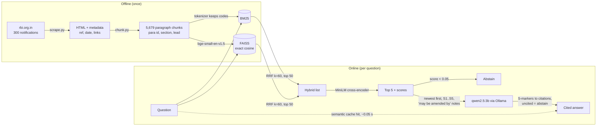

# CircularIQ

Cited question answering over Reserve Bank of India circulars, for the people who read them for a living: compliance teams at banks and NBFCs.

Ask *"How long does a commercial bank have to decide whether a red-flagged account is a fraud?"* and CircularIQ finds the paragraph, answers in plain language, and cites it:

> A commercial bank has 180 days from the date of first reporting the account as red-flagged on CRILC platform to decide whether it is a fraud. [RBI/DoS/2026-27/412, Para 31](https://rbi.org.in/Scripts/NotificationUser.aspx?Id=13641&Mode=0)

*(Actual output, recorded in [docs/demo.webm](docs/demo.webm).)*

When the circulars don't contain the answer, it says **"Not found in the provided circulars."** instead of guessing.

Runs fully offline on a laptop: local embeddings, a local cross-encoder, and a local 3B LLM through Ollama.

| Cited answer | Abstention |
|---|---|
|  |  |

## Architecture



| Stage | Choice | Why (details in [decisions.md](decisions.md)) |
|---|---|---|
| Source | RBI notification pages (HTML) | The PDFs sit behind a CAPTCHA; the HTML has real `<p>` paragraphs and `<table>`s |
| Chunking | One chunk per numbered paragraph (`2.1`, `5(iv)`), tables split with header repeated | Citations need paragraph numbers; fixed windows cut rules in half |
| Dense | `BAAI/bge-small-en-v1.5` + FAISS `IndexFlatIP` | Small enough for CPU; exact search is about 1 ms at this scale |
| Sparse | `rank_bm25`, codes indexed whole + by segment + by atom | `DOR.AML.REC.233/14.06.001/2026-27` must match exactly |
| Fusion | Reciprocal Rank Fusion, k = 60 (hand-written) | Rank-based, so incomparable score scales don't matter |
| Re-rank | `cross-encoder/ms-marco-MiniLM-L-6-v2`, top 50 → 5 | 9× faster than bge-reranker-base on CPU, with equal or better results on probes |
| Answer | `qwen2.5:3b` (Ollama, any OpenAI-compatible API) | Fits a 3 GB GPU; follows the strict citation format |
| Recency | Hyperlinks between circulars → "may be amended by" | Amendments link what they amend: explicit, testable signal |

## Results

89 hand-written gold questions over the corpus: 74 answerable (fact, paraphrase, exact-id, table, recency, colloquial, and cross-circular comparison) and 15 *unanswerable* near-misses. Evidence is stored as (circular, verbatim quote), so the gold set survives re-chunking; comparisons count as retrieved only when *every* side's evidence is found. Full tables and every failure: [data/eval/results.md](data/eval/results.md).

| Configuration | Recall@5 | MRR@10 | Faithfulness | Correct | Answered | Abstention |
|---|---|---|---|---|---|---|
| BM25 only | 86.5% | 0.673 | 65.1% | 70.3% | 79.7% | 100% |
| Dense only | 82.4% | 0.634 | 67.3% | 68.9% | 78.4% | 100% |
| Hybrid (RRF) | 90.5% | 0.716 | 76.5% | 82.4% | 90.5% | 100% |
| **Hybrid + re-ranker (shipped)** | **93.2%** | **0.782** | 72.4% | 79.7% | 86.5% | **100%** |
| + query rewrite | 83.8% | 0.726 | 70.3% | 62.2% | 68.9% | 100% |
| + query router (as specified) | 78.4% | 0.680 | 72.9% | 17.6% | 21.6% | 100% |
| + corrective RAG | 89.2% | 0.775 | 85.1% | 44.6% | 47.3% | 100% |
| + router + corrective RAG | 77.0% | 0.659 | 66.7% | 8.1% | 8.1% | 100% |
| + "quality" router variant | 91.9% | 0.772 | 74.3% | 77.0% | 85.1% | 100% |

*Correct* counts over all answerable questions, so an abstention counts as not correct. *Faithfulness* = share of answer sentences supported by the passage they cite. Both are judged by the local LLM; a hand spot-check agreed on 19/20 correctness and 17/20 faithfulness verdicts, and every disagreement was the judge being too strict.

**What the table says**

- **Hybrid beats either retriever alone.** BM25 and dense miss *different* questions (BM25 the paraphrases, dense the exact codes and most comparisons: 29% vs 71% comparison recall). RRF fusion recovers both.
- **The re-ranker improves retrieval; end to end it's a tie.** Recall@5 rises 90.5% → 93.2% and MRR 0.716 → 0.782. Correctness is 82.4% vs 79.7%, but paired question by question that's 5 wins vs 3 (exact McNemar p = 0.73, one of the five a known judge error): no real difference, because the 3B LLM, not retrieval, is the bottleneck. The re-ranker ships for its retrieval quality and because its scores power the cheap abstention gate.
- **It never answered an unanswerable question.** All 15 near-misses (repo rate, LRS limit, ₹500 note withdrawal, the KYC re-verification period whose base Direction is not in the corpus, …) were refused in every configuration.
- **Three "advanced" components made it worse, and the reasons are specific:**
  - *Query rewriting*: the 3B rewriter "generalises" specific questions (drops "for commercial banks", once turned "Form A2" into "RTGS"). Shipped off.
  - *Query router*: the cheap 1.5B model answered simple questions **correctly but without citations**, so the uncited-means-abstain rule discarded them (7/54 correct vs 42/54). And the "out of scope" route sent 10 answerable questions straight to "I don't know" while catching 1 of 15 unanswerables: in a single-domain corpus the near-misses are *in* scope. A "quality" variant (full model for every answer, routing only for comparisons and vague questions) recovered most of the loss but still didn't beat the baseline. Shipped off.
  - *Corrective RAG*: the 3B grader rejected half the answerable questions, often with the evidence ranked #1, and its retry queries pushed good passages down (0 questions gained, 26 lost, 5.6× slower). CRAG fixes *bad retrieval*, but 11 of the baseline's 15 failures have a top re-ranker score ≥ 0.99: the retrieval is right and the generator misreads. Shipped off.
  - All three remain as config flags and UI toggles, so they can be re-measured with a stronger model.
- **Fixes that came from reading failures:** indexing each short circular's lead paragraph with its chunks (answer paragraphs like "2. … dispense with the above reporting requirements" never name their subject) lifted Recall@5 from 92.5% to 95.5% on the original 82 questions. Accepting citation variants like `[Source S1]` and `[S1-S5]` recovered answers the strict parser was discarding.

**Semantic cache** (on by default in the app; [data/eval/cache_results.md](data/eval/cache_results.md))

| | Result |
|---|---|
| Rephrased questions that reuse the answer | 20 / 20 |
| Look-alike questions (other entity, instrument, code, date) wrongly reusing an answer | **0 / 45** with the signature guard; **18 / 45 with cosine ≥ 0.95 alone** |
| Distinct gold questions wrongly matched | 0 / 3,916 pairs |
| Median latency: full pipeline vs cache hit | 11.3 s vs **0.05 s** |

Cosine similarity alone is unsafe in this corpus: "…exempt from CRR for **commercial banks**?" and "…for **small finance banks**?" score 0.97 but have different answers. A hit therefore also needs identical entity types, acronyms, codes, numbers and months, and identical pipeline settings. Cached answers are dropped when a circular they cite changes.

**Failure analysis (shipped system, 15 of 89)**

| Category | Count | What happens |
|---|---|---|
| False abstention | 9 | Evidence ranked 1–3, but the system declined. Usually the 3B model said "not found" despite the passage, or answered correctly without a citation, so the strict uncited-means-abstain rule discarded it. That same rule also blocked two *wrong* uncited answers (wrong bond tenors; a circular wrongly called "not withdrawn"), a trade worth making in compliance. |
| Wrong answer | 5 | q04 inverts "Board *or* a delegated committee" into "the Board itself"; q38 gives only the unquoted-InvIT rule; q85 misses the ECB side of a comparison. q18 and q43 are actually right: the judge's two known errors. |
| Retrieval miss | 1 | q30: the NRO-return code paragraph ranks 7th behind a near-identical CIMS reporting circular. |

Recency held up: all three "deadline moved from 30 Sep to 31 Aug 2026" traps were answered with the *newer* date.

## Limitations

- **Corpus is a snapshot.** 300 notifications (IDs 13414–13725, 29 Apr – 2 Oct 2026). Consolidated "Updated as on…" Directions whose text exists only as a CAPTCHA-protected PDF are skipped. So the system knows the *amendments* to, say, the KYC Directions but not the base Directions. That is exactly why "KYC re-verification period for high-risk customers" is one of the unanswerable gold questions.
- **Small model.** qwen2.5:3b fits the 3 GB GPU but sometimes misreads a passage. Strict citation checking turns many of those misreadings into abstentions rather than wrong answers, which is the right failure direction for compliance, but it lowers coverage.
- **The judge is the same small model.** Faithfulness and correctness are judged by qwen2.5:3b, which is lenient on its own outputs. A sample was checked by hand (see the results).
- **The eval set is small and has one author.** 89 questions, and the abstention threshold, the lead-paragraph fix and the "quality" router variant were all decided on the same set they are reported on. Treat those numbers as optimistic.
- **Recency is link-based.** "May be amended by" comes from hyperlinks between circulars: precise when present, silent when an amendment doesn't link its predecessor or the predecessor is outside the corpus.

## What's next

1. A held-out question set written by someone who hasn't read the chunks, to get unbiased numbers and an honest abstention threshold.
2. A per-circular cap in the top 5, to fix the "sibling crowding" retrieval failure (D6.9 in `decisions.md`).
3. Date-aware retrieval: when several circulars for the same entity match, boost the newest before re-ranking, so the stale circular stops winning (the q35 failure).
4. A stronger judge (or two judges with disagreement review) for the faithfulness numbers.
5. Fit the LLM fully on the GPU with a quantised KV cache (`OLLAMA_KV_CACHE_TYPE=q8_0`) for faster answers.
6. Re-measure the router and corrective RAG with a stronger model (7B+ or a hosted API). Both failed here for model-capability reasons (uncited small-model answers, an over-strict 3B grader), not design reasons. One `LLM_BASE_URL` change and one `--only` run.

## Running it

```bash
pip install -r requirements.txt
python -m playwright install chromium
ollama pull qwen2.5:3b                        # or set LLM_BASE_URL / LLM_MODEL / LLM_API_KEY

python -m circulariq.scrape --count 300       # data/raw: manifest + HTML (about 3 minutes)
python -m circulariq.chunk                    # data/chunks.jsonl
python -m circulariq.retrieve                 # data/index: FAISS + chunks (embeds on CPU)
streamlit run app.py                          # Ask tab + Evaluation tab

python -m circulariq.evaluate                 # ablation -> data/eval/results.md
python -m circulariq.eval_cache               # semantic cache safety + latency -> data/eval/cache_results.md
pytest                                        # unit + Playwright browser tests
```

`git config core.hooksPath .githooks` enables the pre-commit hook that runs the whole suite before every commit.

## Layout

```
circulariq/scrape.py     crawl RBI notification pages -> manifest + HTML
circulariq/chunk.py      structure-aware paragraph chunking
circulariq/retrieve.py   BM25, dense, RRF, cross-encoder re-ranking, recency map
circulariq/answer.py     Config flags + the pipeline: prompt, citation rendering, abstention
circulariq/cache.py      semantic cache with entity/code signature guard and invalidation
circulariq/router.py     question-type router (opt-in; lowered accuracy in the eval)
circulariq/crag.py       corrective RAG grader + retries (opt-in; lowered accuracy in the eval)
circulariq/evaluate.py   Recall@5, MRR@10, faithfulness, correctness, abstention, ablation
circulariq/eval_cache.py semantic cache hit / false-hit / latency evaluation
app.py                   Streamlit UI
data/make_gold.py        the 89-question gold set (source of truth)
data/eval/               results.md, results.json, and the cached LLM calls behind them
scripts/record_demo.py   drives the app with Playwright to record docs/demo.webm + screenshots
tests/                   pytest + Playwright (real RBI pages as fixtures)
decisions.md             every design decision, the alternatives, and why
```
